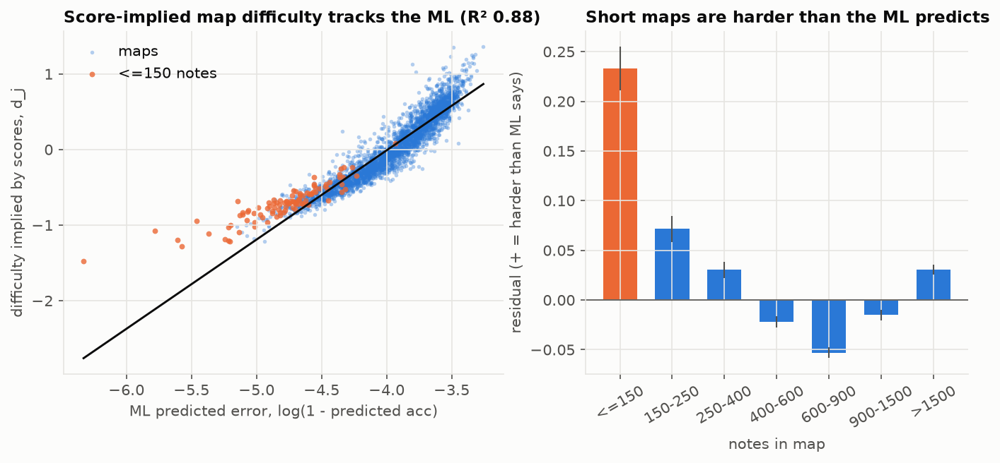
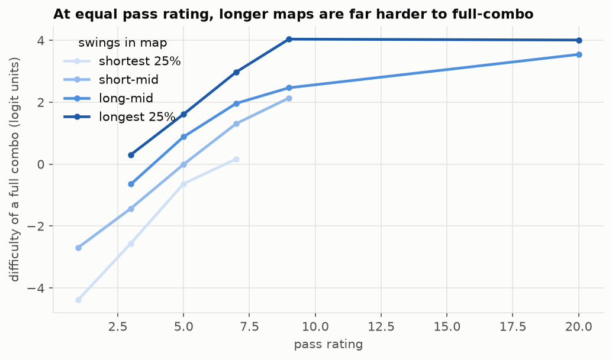
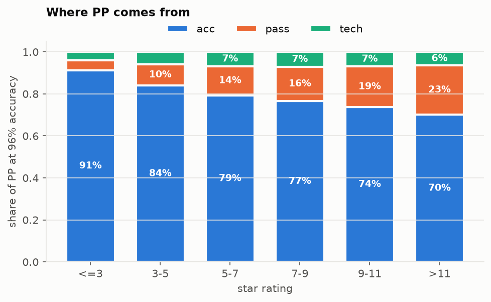
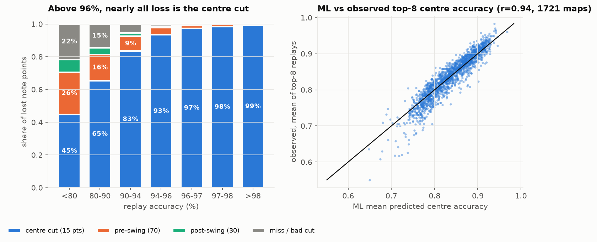
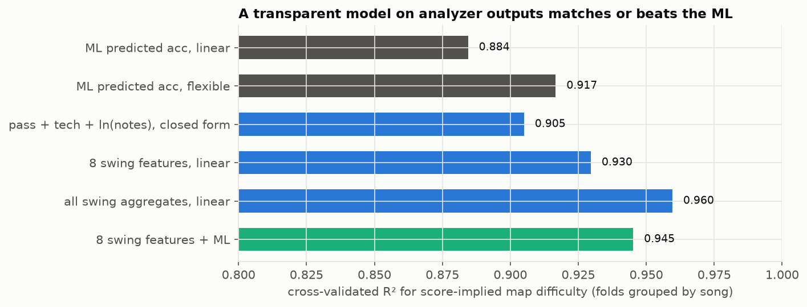
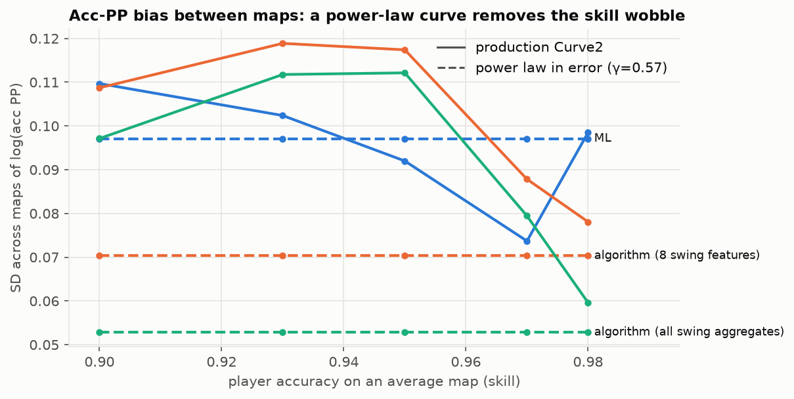
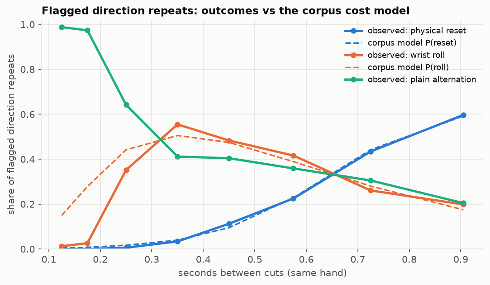
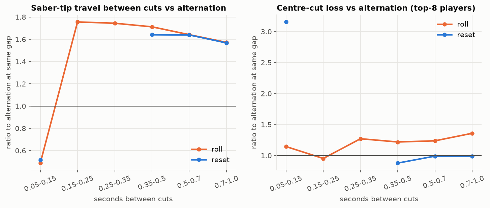

# Map difficulty & PP: how well does the current model work, and what can we improve?

*Study of the portaBLe / RatingAPI difficulty stack (analyzer → `accAI` ONNX model → `AccRating` → PP) using 2.5 M scores, ~3 M replay-note
observations and 32 M recorded attempts. Everything here is reproducible from `Analysis/` (see §9).*

> **Status:** score-side and attempts-side results are final (and were re-checked on the fresh Oct-2026 dump, see `ALGO_ACC_TEST.md`).
> Replay-side numbers (marked ▲) come from a random **47 % sample (1 721 of 3 635 maps, 22 713 replays)** of the replay crawl; the complete crawl
> (3 635 maps, 47 913 replays) finished afterwards and sits in `/root/analysis/out/full` on the server — snapshots at 24 % and 47 % agreed to the
> 2nd–3rd digit, so the full run will only tighten intervals.
>
> **Follow-up implemented:** the multi-feature algorithmic acc rating is now in RatingAPI (`algo-acc` branch) and portaBLe (`algo-acc-test`) as an
> opt-in test — see [ALGO_ACC_TEST.md](ALGO_ACC_TEST.md). Building it surfaced the one real policy decision: the ML's compressed difficulty
> spread over-rewards easy maps and props up lower-rank PP, so a fair rating has to pick between keeping today's PP-versus-skill profile
> (lower power-law γ, 0.50) and keeping today's within-map accuracy reward (γ 0.60, lower ranks −10 to −13 %). Three test DBs show the options.

---

## 1. Summary

**How well does the current algorithm model difficulty and reward it?**

| Axis | Verdict | Key evidence |
|---|---|---|
| **Accuracy difficulty** (`accAI` + curve) | **Good**, with fixable systematic errors | Score-implied map difficulty vs predicted acc: r = 0.94 (R² 0.88, 0.92 with a flexible fit). Residual ≈ ±17 % in error rate ≈ ±10 % acc‑PP at equal skill. Misses: short maps (<150 notes) are ≈25 % harder than predicted; U‑shaped bias across the range; speed‑modifier shifts are essentially unpredicted (R² < 1–8 %). |
| **Pass difficulty** (`PassRating`) | **Good for intensity, blind to length** | FC‑difficulty r = 0.86 with pass rating (R² 0.74). Adding map length lifts R² to 0.91. Local swing difficulty predicts *where* players fail (per‑map Spearman 0.41, 94 % of maps positive). |
| **Tech** (`TechRating`) | **Weak on its own, mostly redundant** | Alone explains 56 % of acc difficulty; unique share 3 %. Only 4–7 % of PP. |
| **PP formula** | **Self‑consistent to ≈ ±8 %; one structural flaw** | The acc curve is not a power law in error, so the same map is mis‑priced by an amount that depends on *player skill* (a wobble of up to ±6–10 % for 0.90–0.97 players that even a perfect difficulty oracle cannot remove). |

Two structural facts drive everything below:

1. **Difficulty is essentially one‑dimensional.** After player skill and map difficulty, a 3rd latent "specialisation" dimension adds only +2 % R²;
   FC difficulty and accuracy difficulty correlate 0.96; pass, tech and ML ratings share ~90 % of their information about accuracy difficulty.
2. **Skill acts multiplicatively on error rate, identically on every map.** In `log(1 − acc)` space map difficulty ordering is the same for low/mid/high
   skill players (r 0.96–0.98, slope 0.997) and per‑map slopes are 1.00 ± 0.07.

**Feasibility of the three proposed improvements**

| # | Proposal | Verdict | One line |
|---|---|---|---|
| 1 | Replace `accAI` (ML) by a defined algorithm; redistribute ratio | **Feasible and likely beneficial at map level; do not replace the per‑note graph yet** | A 3‑term closed form (`0.089·pass + 0.084·tech + 0.068·ln(swings)`) already reaches R² 0.90 on score‑implied difficulty (ML: 0.88/0.92); 8 features 0.93; all swing aggregates 0.96 (song‑grouped CV). Acc‑PP bias drops from ±9.7 % to ±5–7 %. Handles speed modifiers far better. Per‑note fidelity needs interactions (additive 0.43 vs ML 0.52 top‑8 note R²; a GBM on swing features matches the ML at 0.52). |
| 2 | Per‑map accuracy curve | **Not worth it; fix the global curve instead** | Per‑map slope adds +0.25 % R² and is only 34 % predictable. The measurable defect is global: replace `Curve2` with a constant‑exponent (power‑law‑in‑error) curve. |
| 3 | RatingAPI‑corpus improvements | **Feasible and low risk; worth porting for model fidelity, not for rating accuracy** | The reset/roll model is well calibrated against 1.6 M observed transitions (expected resets 2 943 vs 2 934 observed; production's ×2 over‑counts 5×) and the dot model cuts median direction error 14.4° → 4.4° ▲. But map‑level fit to score/FC/attempt outcomes is not better (R² 0.9025 vs 0.9065), player rankings are unchanged (Spearman 0.99998), and one claim (reset precision penalty) does **not** replicate. Port is contained but the corpus controllers are stale. |

---

## 2. The system under test (as implemented)

* **Analyzer** (`RatingAPI/Analyzer`, submodule used by portaBLe): parity prediction → swings → per‑swing
  `SwingDiff = swingSpeed·lowSpeedFalloff·stressMult·njsBuff·(1.05 stream)·wallBuff`; **pass** = mean over window sizes {8,16,32,64,128} of the max rolling mean of
  `SwingDiff`, × a hand‑balance nerf, × 0.825; **tech** = mean of the top 75 % of `SwingTech` × `(1−1.4^−pass)` × 14; `LowNoteNerf = 0.6 + (clamp(notes,20,200)−20)/450`.
* **`accAI`** (`model_sleep_bl.onnx`, identical to the deployed file): sequence model; for each 8‑note segment, 12 notes of context before/after, 49 features per note; outputs a
  **centre‑cut accuracy** per note (0‑1 of the 15 centre points). Map `PredictedAcc` = score‑weighted mean assuming perfect 100‑point swings, then `ScaleFarmability`.
  *Quirk (verified on all 3 635 maps):* only whole 8‑note segments are predicted; exactly the last `n mod 8` notes (mean 3.5, max 7) are silently dropped — negligible for rating accuracy, but the per‑note graph is shorter than the map.
* **Rating:** `AccRating = 15.5 / Curve(predAcc + 0.0022) × LowNoteNerf`, i.e. *every map pays the same acc PP at its predicted accuracy*.
* **PP:** `pass = 15.2·exp(pass^(1/2.62)) − 30`; `acc = Curve2(acc)·accRating·34`; `tech = exp(1.9·acc)·1.08·tech`; `PP = 650·(Σ)^1.3 / 650^1.3`; stars = PP(96 %)/52;
  player total = Σ PP·0.965^rank. (A numpy port of this, `py/ppmodel.py`, reproduces portaBLe's C# PP to 3e‑7.)

---

## 3. How well does the model describe reality?

### 3.1 Method — a ground truth that does not depend on the algorithm

From the dump (3.06 M scores, 108 k players, 3 635 ranked leaderboards; scores up to **Apr 2025**), keeping modifier‑free scores of players with ≥ 15 scores on maps with ≥ 40 scores
(2 470 866 scores, 23 719 players, 3 573 maps), fit

`log(1 − acc_ij) = d_j − a_i + noise`   (a_i player skill, d_j **score‑implied map difficulty**).

Held‑out R² of this model is **0.796** (player only 0.60, map only 0.17). `log(1−acc)` is the right space: linear accuracy gives 0.65, logit 0.78, and per‑map slopes are 2.5× more
heterogeneous in linear space (CV 0.19 vs 0.074), so apparent need for per‑map curve *shapes* is largely a coordinate artefact. d_j is estimated to reliability 0.999 (median sampling SD 0.013 vs SD 0.47 across maps).

### 3.2 Accuracy difficulty (the `accAI` + analyzer outputs)



| Predictor of d_j (song‑grouped CV where fitted) | R² |
|---|---|
| ML predicted accuracy, linear (2 params, no leakage possible) | 0.884 |
| ML predicted accuracy, flexible 1‑D | 0.917 |
| pass rating alone / tech alone | 0.765 / 0.560 |
| pass + tech (no ML) | 0.899 |
| ML + pass + tech | 0.939 (unique: ML 4.0 %, pass 3.7 %, tech 3.2 %) |
| + map shape stats (length, notes, density, NJS…) | 0.954 |

Systematic misses of the ML (residual of d_j vs ML, `log` units, + = harder than ML says):

* **U‑shape** across predicted accuracy: +0.11 (hardest decile) → −0.09 (middle) → +0.12 (easiest decile).
* **Short maps:** ≤150 notes +0.23 (≈ 26 % more errors than predicted; 98 maps = 2.8 %); 150–250 +0.07. Of the 20 largest outliers (85 % "harder than predicted"), 7 are such tiny ≤1★ maps — low PP stakes — and most of the rest are 10–13★ maps (Speedcore Paradise, stasis, Extratongue, Chrome Vox, Break…) that players do markedly worse on than predicted. `LowNoteNerf` and `ScaleFarmability` assume short maps are *easier*; the data says the opposite for the tiniest ones.
* **`ScaleFarmability` does not help against score data:** the raw model output explains d_j slightly *better* (R² 0.900) than the farm‑adjusted `PredictedAcc` (0.884); adding log(length) and log(notes) to the raw output adds only 0.002.
* **Pass/tech information is missing** (see §3.6: the ML models only the 15‑point centre cut).
* The "ML tracks whoever happens to be top‑8" worry is **rejected**: residual vs mean skill of the map's top 8 players has r = 0.07 (top‑8 skill varies only SD 0.16 across maps).

### 3.3 Speed modifiers

For SS/FS/SF scores the per‑map shift in difficulty is estimated with player skill from clean scores (unpaired; self‑selection adds an offset but not map‑to‑map variation):

| | maps | mean real shift | mean ML shift | R² of real per‑map shift explained by… ML shift | analyzer Δpass, Δtech |
|---|---|---|---|---|---|
| FS | 751 | +0.085 | +0.110 | 0.08 | 0.13 (both: 0.25) |
| SF | 521 | +0.193 | +0.244 | **0.01** | **0.51** |
| SS | 33 | −0.213 | −0.080 | 0.01 | 0.49 |

The ML's *average* speed shift is right but its per‑map pattern is uninformative; the analyzer (swing speeds scale with `speedMult`) is already much better.

### 3.4 Pass difficulty

* Full‑combo difficulty `b_j` (logistic skill/difficulty model, McFadden R² 0.54) correlates **0.86 with pass rating** (0.96 with d_j).
* **Endurance gap:** at fixed pass rating, FC difficulty rises ~4–5 logits from the shortest to the longest quartile of maps (coefficient 1.75 per e‑fold of swings); pass + tech + length → R² 0.91 vs 0.84 without length.



* Attempts (32.2 M recorded attempts, 3 573 maps; supporters only — relative comparisons only): logit(success rate) R² 0.71 from pass alone, 0.79 with tech + notes + length; stars 0.74; d_j 0.76.
* **Within a map**, failure hazard follows local analyzer difficulty: per‑map Spearman(hazard, local mean `SwingDiff`) = 0.41 (94 % of maps > 0); regression coefficient on log local `SwingDiff` 0.71 (t = 79), on tech 0.83.
  This is direct support that the window‑based pass rating is measuring the right thing locally.
  Caveat on "endurance": *within* a map the hazard does **not** rise late (coefficient on position in song −1.26, confounded by survivorship — weaker players have already left). The length effect is *between* maps (longer maps are failed more at equal pass rating), consistent with cumulative per‑note risk rather than fatigue — so a length term (e.g. `ln(swings)`) captures it better than a time‑in‑song ramp.
* **Where individual notes are missed ▲** (mid‑field replays, 400 maps, 2.3 M note events, 25 198 misses/bad cuts; AUC of ranking missed notes *within the same replay*, i.e. player skill removed; the top‑8 replays have only 212 misses in 3.2 M notes, so no signal there):

| predictor of a miss / bad cut | within‑replay AUC |
|---|---|
| **ML centre‑accuracy error (1 − predicted note acc)** | **0.641** |
| window‑mean `SwingDiff` (4–16 swings) | 0.600–0.604 |
| `SwingDiff`, swing speed | 0.592, 0.590 |
| hit distance, frequency, angle strain | 0.571, 0.563, 0.560 |
| position in song, swing tech | 0.548, 0.545 |
| rotation, repositioning, parity flag | 0.501, 0.500, 0.503 |
| GBM, all swing features + ML + position in song + skill proxy | 0.682 |
| GBM, `SwingDiff` + window + skill proxy only | 0.605 |

  Per‑note miss localisation is intrinsically weak (best single feature 0.64): the ML's note‑level difficulty is the single most useful signal even for misses, and the analyzer's windowed `SwingDiff` comes second. Position in song adds little (AUC 0.55).
* The *peak‑type* pass rating has no length term; the repo's recent "stamina pp implementation port" commit (39b4fe6) is aimed at exactly this — the numbers above are a baseline to evaluate it against.

### 3.5 PP reward



* PP composition at 96 % accuracy (map ratings): acc 91 % → 70 %, pass 5 % → 24 % (≤3★ → >11★); tech 4–7 %. Top 1 000 players (weighted): **pass 25 %, acc 69.5 %, tech 5.6 %**.
* **Map bias at equal skill** (SD of log PP across maps for equally skilled players): total PP ±8.5 % *within star buckets* (≥3★); acc component alone ±7–11 % depending on player skill (±9.7 % rating error alone) — see §4.
* **Skill‑dependent wobble:** `Curve2`'s local exponent d ln(curve)/d ln(1/err) is 1.04, 0.78, 0.62, 0.46, 0.48, 0.72, 0.57 over acc 0.6→0.995 — not constant.
  Because skill is multiplicative (§3.1), the acc PP of the *same map* is mis‑priced by an amount that depends on the player's accuracy; ratings are calibrated at the ML's predicted accuracy (≈ 0.98 on an average map) so players at 0.90–0.95 sit far from the calibration point.
  A **perfect** difficulty oracle on `Curve2` still has ±6–10 % acc‑PP map bias for 0.90–0.97 players (0.081 / 0.101 / 0.102 / 0.060 at 0.90 / 0.93 / 0.95 / 0.97, 0.009 at 0.98); with a constant‑exponent curve the same oracle has exactly 0.
* **Star gradient:** at equal demonstrated skill, PP rises with stars (−0.72 log‑units for ≤3★ → +0.23 for >11★, partly the by‑design pass premium). Within a star bucket the SD is 0.073–0.105 (≥3★) and 0.30 (<3★).

### 3.6 What the replays show ▲

Replay crawl (random 47 % sample): **1 721 maps, 22 713 replays** (8 best clean + 6 stratified across the 12th–88th score percentile per map), 25.0 M note events, 1.71 M swings; > 99.9 % of good cuts matched to analyzer swings.



* **Where accuracy is lost.** Above 96 % accuracy, 97–99 % of the lost points are the **centre cut**; at 90–94 % it is 84 % centre, 9 % pre‑swing, 2 % post‑swing, 5.5 % misses; at 80–90 % only 65 % is centre and 15 % is misses. The ML models the centre cut only.
* **The ML is an unbiased predictor of top‑8 centre accuracy:** map level r = 0.94 over 1 721 maps, bias +0.000, SD of difference 0.022 (≈ 0.32 of 15 points); note level r = 0.71 (R² 0.51; observed top‑8 means have split‑half reliability 0.715, so the ML explains ≈ 71 % of the explainable variance); within‑map r 0.61.
* **What drives each loss component** (standardised coefficients on log loss, replay level; skill controlled):

| component | skill | ML centre error | pass | tech | R² (skill only → full) |
|---|---|---|---|---|---|
| centre loss | −0.48 | **+0.28** | 0.04 | 0.03 | 0.54 → **0.90** |
| pre‑swing loss | −1.15 | 0.11 | **+0.17** | **+0.12** | 0.67 → 0.74 |
| post‑swing loss | −0.91 | 0.05 | **+0.38** | −0.04 | 0.48 → 0.60 |
| miss + bad cut rate | −0.63 | 0.10 | 0.06 | 0.07 | 0.54 → 0.62 |

  This is the mechanism behind §3.2: the ML explains the centre cut (R² 0.90) and nothing else; pass/tech explain swing‑angle losses and misses, which are 15–40 % of the loss for typical players.
* **Swing level, which predicted quantity tracks real loss?** (within‑map Spearman of ≈ 1 M swing×stratum observations, 500 maps; top‑8 / mid‑field):

| predicted per swing | centre loss | pre‑swing loss | post‑swing loss | miss + bad cut |
|---|---|---|---|---|
| `SwingDiff` (pass quantity) | 0.26 / 0.18 | 0.05 / 0.10 | 0.10 / 0.16 | 0.01 / 0.07 |
| swing speed | 0.23 / 0.17 | 0.04 / 0.07 | 0.11 / 0.17 | 0.01 / 0.07 |
| frequency (1/gap) | 0.21 / 0.15 | 0.03 / 0.11 | 0.07 / 0.15 | 0.00 / 0.05 |
| hit distance | 0.10 / 0.07 | 0.04 / −0.11 | 0.09 / 0.06 | 0.01 / 0.06 |
| angle strain | 0.14 / 0.10 | 0.02 / 0.07 | 0.02 / −0.02 | 0.01 / 0.04 |
| repositioning | 0.03 / 0.01 | 0.10 / 0.06 | −0.05 / −0.07 | 0.01 / 0.01 |
| rotation | 0.05 / 0.05 | −0.02 / −0.03 | −0.03 / −0.01 | 0.00 / 0.00 |
| **parity‑error flag** | −0.01 / −0.02 | 0.00 / 0.01 | 0.01 / 0.02 | 0.01 / 0.01 |
| multi‑note swing (`note_count`) | 0.18 / 0.05 | 0.25 / 0.16 | −0.01 / −0.05 | 0.00 / 0.05 |

  The pass‑type per‑swing quantity is the best single predictor of every loss component; of the tech parts only angle strain shows a (modest) signal, rotation and repositioning are ≈ 0, and a *flagged parity error is not, by itself, associated with any extra loss* (consistent with only 19 % of flags being physical resets, §6).

---

## 4. Feasibility 1 — `accAI` → a defined algorithm, and the pass/acc/tech ratio



### 4.1 Can a transparent model predict accuracy difficulty as well as the ML?

Yes at map level (all CV folds grouped by song; target = score‑implied d_j):

| Model | features | R² |
|---|---|---|
| **A (closed form)** `d̂ = −1.237 + 0.0885·pass + 0.0844·tech + 0.0678·ln(swings)` | 3 existing outputs | **0.905** (CV) |
| 8 features (+ log mean/p99 `SwingDiff`, nerf, NJS, length) linear | 8 | 0.930 |
| GBM on the same 8 | 8 | 0.945 |
| all 66 swing aggregates, linear | 66 | **0.960** |
| ML (for reference) | – | 0.884 / 0.917 |
| ML + 8 swing features | 9 | 0.945 / 0.957 |

The ML itself is almost a function of swing aggregates (distillation R² 0.97 from all aggregates, 0.92 from 8). So the ML is not hiding information the analyzer lacks; it is a (good) estimator of *centre* loss, while real accuracy loss contains more.

**Speed modifiers come for free.** Evaluating the same closed form on the analyzer's own SS/FS/SF pass/tech/swing outputs predicts the real per‑map shift for SF with **R² 0.50, slope 1.11** (mean +0.203 vs +0.219 real; ML: R² 0.01); FS 0.09 vs ML 0.08 (both within sampling noise, real SD 0.08); SS 0.25 (33 maps).

Converting `d̂` to a rating is one line: `predAcc* = 1 − exp(d̂ − 3.99)` (3.99 = reference skill implied by today's ratings) and the existing `AccRating`/`Curve` code. On the 3 500 maps with ≥100 scores the model‑A predicted accuracy differs from the ML's by 0.003 on average (r = 0.875).

### 4.2 What it buys (acc‑PP bias between maps at equal skill, SD of log acc PP)



| source | `Curve2`, player skill 0.90 / 0.95 / 0.98 | power‑law curve (any skill) |
|---|---|---|
| ML (production) | 0.110 / 0.092 / 0.098 | 0.097 |
| algorithm, 8 swing features | 0.109 / 0.117 / 0.078 | 0.070 |
| algorithm, all swing aggregates | 0.097 / 0.112 / 0.060 | **0.053** |
| ML + 8 swing features | 0.107 / 0.115 / 0.068 | 0.062 |
| oracle (score‑implied d_j) | 0.081 / 0.102 / 0.009 | 0.000 |

An algorithm only helps fully if it comes **with** the curve fix (§5): on today's `Curve2` the algorithm is *worse* for mid‑skill players, because its ratings are more spread out than the ML's compressed ones (the ML under‑states real difficulty differences by a factor 1.18) and `Curve2` then mis‑prices them.

### 4.3 Player impact (full PP re‑computation of 2.5 M scores, `py/a08_pp_scenarios.py`)

| scenario | Spearman vs prod | top‑100 overlap | top‑100 PP ratio | top‑1000 PP change (p5/p95) | stars slope of bias |
|---|---|---|---|---|---|
| ML + power‑law curve | 0.998 | 89 | 1.04 | 0.95 / 1.07 | 0.051 (prod 0.073) |
| algorithm (8) + Curve2 | 0.999 | 93 | 1.13 | 1.07 / 1.15 | 0.076 |
| algorithm (8) + power‑law | 0.998 | 94 | 1.17 | 1.04 / 1.18 | 0.058 |
| algorithm (all) + power‑law | 0.998 | 96 | 1.16 | 1.05 / 1.17 | 0.057 |

Rankings are very stable (Spearman ≥ 0.998). The *scale* moves (top‑100 +13–17 %) because algorithmic difficulty is spread more widely; a global constant (and policy decision) recalibrates it.

**Megametric (the existing yardstick), exploratory** — recomputed from clean scores with the `LeaderboardsRefresh` definition under each scenario (`py/a12_megametric.py`; 3 495 maps with ≥100 scores):

| scenario | mean mm125 | SD | CV | maps ≥ 0.65 (nerf threshold) | corr with stars |
|---|---|---|---|---|---|
| production (ML + Curve2) | 0.186 | 0.185 | 0.99 | 3.6 % | 0.66 |
| ML + power‑law curve | 0.199 | 0.171 | **0.86** | 3.1 % | 0.53 |
| algorithm (8 feat) + power‑law | 0.180 | 0.192 | 1.07 | 4.3 % | 0.50 |
| algorithm (all feat) + power‑law | 0.189 | 0.182 | 0.96 | 3.4 % | 0.59 |

The Megametric's spread across maps (CV ≈ 1) barely reacts to the rating source: it is dominated by how many players' top‑40 a map lands in (popularity/farm‑ability), not by rating error. It is therefore a poor yardstick for *validating* a rating source and is not expected to show the improvement of §4.2; the skill‑conditioned bias metric (`py/a07_accpp_bias.py`) is a better acceptance test. (Computed on modifier‑free scores only, so absolute values are below portaBLe's.)

### 4.4 The ratio question (pass / acc / tech weights)

* **The three ratings are heavily redundant about accuracy difficulty** (unique shares 3–4 % each, §3.2). A sum of three correlated measures is not wrong per se — they price different *constructs* (passing, precision, tech) — but if `AccRating` is rebuilt from the same swing quantities as pass/tech, correlation rises further and the existing weights risk double‑counting (not measurable from scores alone — see below).
* Within the 2.5 M‑score test, lowering the pass multiplier (×0.9 / ×0.8) or tech (×0.7) barely changes within‑star map bias (0.078–0.082 vs 0.082 for the all‑feature algorithm + power law) — **total‑PP map bias is dominated by the pass/tech terms and the stars gradient, not by the acc rating**, so reweighting is a *policy* lever (composition: top‑1000 pass share 25 % → 22 % with the algorithm; ×0.9 pass moves it to 20 %), not a consistency fix.
* Data‑backed guidance: (i) recalibrate one global constant after swapping the source (§4.3), and keep the top‑1000 composition (pass 25 / acc 69.5 / tech 5.6 %) by re‑scaling pass ≈ ×1.1–1.2 if that composition is desired; (ii) **fit** the weights against **attempts data** (§7) — scores cannot tell us what the right price of passing is.

### 4.5 Where the ML is still needed — per‑note output ▲

PP only needs the map‑level number, but RatingAPI also serves a per‑note graph (`/ppai2/graph`, `/json/.../full`). Per‑note centre‑accuracy models (song‑grouped CV, 400 maps, 5.7 M note rows, 1 721‑map snapshot):

| model | top‑8 note R² | within‑map r |
|---|---|---|
| ML (raw, unscaled) | 0.502 | 0.616 |
| ML + skill | 0.521 | 0.616 |
| swing features + skill, **GBM (interactions)** | **0.520** | 0.606 |
| swing features + skill, **additive** (tabulatable) | 0.426 | 0.521 |
| 8 swing features + skill | 0.297 | 0.341 |
| swing features + ML + skill | 0.555 | 0.631 |

(noise ceiling: split‑half reliability of the observed means 0.715). So an interaction‑capable model on analyzer features **matches the ML note by note** (0.520 vs 0.521) after training on only ~320 maps; a purely additive (lookup‑table) model gets ≈ 82 % of it. **Recommendation:** use the defined algorithm for ratings; keep the ML for the per‑note graph until a replay‑trained note model is built (the replay corpus is exactly the training set for it — a GBM on the analyzer's swing features is the obvious first candidate).

### 4.6 Risks / unknowns

* Evaluation target is accuracy difficulty from **Apr‑2025** scores: re‑fit coefficients on current data before shipping. Structural findings should hold; absolute constants (3.99, 0.0885…) will move.
* `d_j` is conditioned on who plays a map (all‑player population); verified not to track the top‑8 skill, but very low‑play maps are noisy (≥100 scores required here).
* Farming: `ScaleFarmability` encodes assumptions (30 attempts/hour sessions…). Attempts data (§7) can calibrate it directly; today's short‑map residual (+0.23) says the ML (with `ScaleFarmability`) under‑rates the accuracy difficulty of the tiniest maps.
* Collinearity with pass/tech (above).

### 4.7 Suggested plan (rough effort: 1–2 weeks of engineering plus a re‑rate)

1. Re‑fit model A / 8‑feature on the current DB (+ speed‑modifier variants through the analyzer's own `speedMult`).
2. Ship behind a flag alongside the ML rating; compare Megametric and the acc‑PP bias metric (`a07`) per map.
3. Introduce the power‑law curve (§5) in the same release (otherwise mid‑skill bias gets worse, §4.2).
4. Re‑calibrate global constant(s); decide pass/tech composition (policy) — fit with attempts data.
5. Train the replay‑based per‑note model (optional follow‑up) and retire the ONNX dependency for ratings.

---

## 5. Feasibility 2 — per‑map accuracy curve

**Finding: a global curve with the right *shape* is what is missing, not a per‑map curve.**

* In error space the structure is universal: slope 1.005 ± 0.074 across maps (true SD ≈ 0.068 after removing sampling noise), identical map ordering across skill bands (r 0.96–0.98, slope 0.997), per‑map offset+slope adds **+0.25 %** R² to the additive model, rank‑3 player×map interaction +2.0 %.
* Only 34 % of the true slope variance is predictable from analyzer outputs and map statistics, so a *predicted* per‑map curve would capture ≈ 1/3 of an effect worth at most ±6 % acc‑PP for the extreme skill range (p10 → p90 of players).
* **The fixable defect:** `Curve2` is not a constant‑exponent function of error (local exponents 0.46–1.04), so equal‑skill pay differs by map depending on player skill (ML: SD 0.074–0.110 across skill; a *perfect* oracle on `Curve2` still 0.06–0.10 for 0.90–0.97 players).
  A constant‑exponent curve `curve(acc) = (1 − acc + ε)^−γ` makes the oracle exactly consistent at all skill levels.
* γ is a **policy knob** (how steeply PP rewards fewer errors). The fit to `Curve2` over 0.8–1.0 is γ ≈ 0.60, ε ≈ 0.0016 (RMS log error 0.076); γ = 0.57, ε = 0.002 (normalised to 1.0 at 95 %) moves PP by −7 % at 85–90 %, +3–5 % at 96–97.5 %, −15 % at 99 % and −22 % at 99.5 % relative to `Curve2`; a larger γ (≈ 0.65–0.70) keeps the top end.
* If per‑map curves are still wanted later, parameterise as an *exponent multiplier* `s_j` on the same family and predict it from analyzer features once (a) the ratings are algorithmic (so it can use their intermediate quantities) and (b) attempts/replay data identify what drives it.

---

## 6. Feasibility 3 — RatingAPI improvements from RatingAPI‑corpus ▲

### 6.1 What the corpus branch changes (diff of the analyzers)

| change | files |
|---|---|
| direction‑repeat model: `DirectionRepeat = parity error OR identical consecutive arrows`; frequency `× (1 + P(reset | gap))`; tech `× (1 + 0.30·P(roll) + 0.50·P(reset))` (replaces ×2 frequency and `/2` tech on parity errors, and the EBPM false‑positive halving) | `TransitionCosts.cs` (new), `SwingCreation.cs`, `AnalyzeMap.cs`, `SwingData.cs` |
| dot‑note direction model (`dot_direction.onnx`, 17 features) | `DotDirectionModel.cs` (new), `PreprocessNotes.cs`, `Cube.cs`, host `DotDirectionOnnx.cs` |
| deterministic sorting (ties by hand/position/direction) | `BeatmapScanner.cs`, `AnalyzeMap.cs`, `SwingCreation.cs` |

### 6.2 Validation against observed play (1.64 M swings with frame‑verified transitions, 1 721 maps, top‑8 and mid‑field replays)



| claim | result |
|---|---|
| Production parity flag ⇒ reset, frequency ×2 | Of 14 634 flagged swings only **18.5 % are physical resets**, 40 % rolls, 42 % plain alternations. ×2 predicts 14 634 resets, observed 2 829 (**5.2× over**). |
| EBPM false‑positive halving | Works: the 1 567 swings it demotes are 81 % alternation; the 13 067 it keeps as resets are 20 % reset / 43 % roll / 37 % alternation. |
| Corpus `P(reset|gap)` | **Well calibrated** on flagged repeats (predicted vs observed 0.017/0.006, 0.039/0.034, 0.095/0.113, 0.228/0.225, 0.442/0.434, 0.592/0.597 over gap bins 0.2–0.3 … 0.8–1.0 s); expected resets **2 943 vs observed 2 934**. |
| Corpus `P(roll|gap)` | Good for gaps ≥ 0.2 s; **below 0.2 s flagged repeats are 97–99 % plain alternation** (model gives 5–28 % roll) ⇒ small tech over‑charge at very fast gaps. |
| Direction‑repeat recall | Swings *not* flagged are repeats in only 0.2 % of cases; 57 % of flagged are observed repeats (roll + reset). |
| Behaviour is skill‑independent | Share of repeats executed with ≥ 2 arm turnarounds: top‑8 0.162 / 0.422 / 0.627 vs mid‑field 0.174 / 0.438 / 0.640 at gaps 0.4–0.6 / 0.6–0.8 / 0.8–1.0 s ⇒ the cost model should generalise beyond top players. |
| Dot‑note direction | median error **14.4° → 4.4°** (mean 20.6° → 8.3°), n = 102 940 single dots. **Caveat: the model was trained on ranked‑pool replays — these maps are in‑sample.** Non‑dot arrows have 12° median error, i.e. dots are now predicted *better* than arrows because the model learns the players' actual under‑swing. |
| "Players lose 25–50 % cut precision on repeats" | **Partly replicated.** Rolls: centre loss **+22 … +36 %** vs alternation at gaps ≥ 0.25 s (matched gap), miss + bad‑cut rate ×2.0–2.8. **Resets: −12 … −1 %** centre loss (as accurate as alternation, *top‑8 players*), miss rate ×1.0–1.6 on few events. So `RESET_TECH_WEIGHT = 0.50` is not supported by cut data; resets are costly in **time/effort** (tip travel ×1.57–1.64), not precision. |
| Physical work | **Rolls travel as far as resets** (tip path ×1.57–1.76 vs alternation at the same gap, gaps ≥ 0.15 s), yet the corpus model gives rolls no frequency multiplier (only tech 0.30). |



### 6.3 Impact on ratings and PP

* Without the dot model 95.6 % of maps move < 0.05★; with it **22 %** (806 maps) move > 0.05★, 7.9 % (288) > 0.1★, 0.4 % (16) > 0.25★, and **94 % of the maps that move > 0.1★ go up** (mean `stars` +0.03★, `tech` +0.18, `pass` unchanged). The big downward movers are parity‑heavy maps (Speedcore Paradise 11.15★ → 9.33★ with pass 13.3 → 6.1 and tech 6.7 → 11.9; "My Album Is Out On Dance Corps…" 9.08★ → 7.87★); upward: The Purple Dimension 15.76★ → 16.45★.
* **Map‑level validity is neutral to slightly worse, not better.** Fit of three independent outcome measures by `pass + tech + ln(swings)` (R²):

| analyzer | score‑implied accuracy difficulty | full‑combo difficulty | attempt success (logit) |
|---|---|---|---|
| production | **0.9065** | **0.9096** | 0.7652 |
| corpus, no dot model | 0.9055 | 0.9088 | 0.7653 |
| corpus + dot model | 0.9025 | 0.9069 | 0.7637 |
| corpus + replay‑driven adjustments (below) | 0.9029 | 0.9070 | 0.7636 |

  On the 285 maps that move > 0.1★ with corpus + dot, the corpus rating is closer to the observed outcome on only 31 % (accuracy difficulty), 32 % (FC) and 44 % (attempts) of them. The dot model carries the (small) loss; the transition‑cost model alone is neutral. The *replay‑adjusted* variant — reset precision weight 0.5 → 0, repeats charged in frequency (`× (1 + 0.65·(P(reset) + P(roll)))`, from the measured ×1.6–1.7 tip travel), no roll probability below 0.2 s — fits the same as the branch as is. So these are **fidelity‑of‑the‑play‑model improvements; they are not visible as better map‑level difficulty against score, FC or attempt data**. (Outcome measures can only validate the aggregate pass/tech level, not how it is split between swings.)
* **PP/player effect is negligible:** Spearman of player totals 0.99998, top‑100 overlap 100/100, top‑1000 PP +0.5 % (SD 0.1 %), median rank shift 2 places; per‑score PP −1 %…+3 % (p1…p99).

### 6.4 Porting feasibility

* **Contained:** 2 new analyzer files + 8 modified (two of them trivial: `Analyze.cs` static/instance, `Difficulty.cs` empty‑list guard); both analyzers use byte‑identical nested parser copies; the dot model is one extra 3.8 MB ONNX file.
* **Not drop‑in:** `RatingAPI-corpus` controllers are *behind* `RatingAPI` (no thread‑local ONNX sessions, embedded models, `notesToIgnore`, `song_length`, throttled downloader) and do not compile against the corpus analyzer (`Analyze` is static there, instance in portaBLe; `MultiRating` vs `MultiPercentage`). The corpus csproj references a sibling `beatleader-parser` that is not in this tree, and `SwingCorpus` targets a newer static `MapParser` API. **Port the analyzer‑level changes onto the current RatingAPI**, not the corpus controllers.
* Determinism: the sorting change alters tie ordering → plan one full re‑rate and diff (the `--ratings-only` flow already exists).
* Runtime: dot model adds one ONNX call per map (≈ ms); register at startup as in `DotDirectionOnnx.Register()`.
* Recommended adjustments before shipping (correctness items; map‑level fit is unaffected, see §6.3): (1) lower the **reset** tech weight toward 0 and charge that cost as effort/frequency; (2) charge **rolls** via frequency (≈ ×1.6–1.7 of tip travel) as well as tech; (3) no roll probability below 0.2 s gaps where flagged repeats are alternations; (4) re‑validate the dot model on maps *not* in its training set — its small negative map‑level effect (−0.003 R²) is the first thing to re‑check on out‑of‑sample maps.

---

## 7. Attempts data — learning curves, and what to export

**Which scores to measure/tune with (and what was used here).** Every ranked score in the export (best General-context score per player and
leaderboard, PP > 0, non-banned) that has no gameplay-changing modifier (IF/BE allowed), restricted to players with ≥ 15 and maps with ≥ 40 such
scores — *all* of them, not top-N and not a random sample: Apr-2025 dump 2.47 M scores, fresh dump 3.54 M (32.8 k players, 3 872 maps). Choosing
scores is the hard part only if the model does not account for *who* set them; here every player's skill is estimated jointly with every map's
difficulty (`log(1 − acc) = d_map − skill`), so a weak player's 90 % and a strong player's 99 % on the same map both inform the same `d_map`.
Re-estimating difficulty from other selections barely changes it (fresh dump):

| scores used | correlation with the all‑score difficulty | slope | algorithm R² | ML R² |
|---|---|---|---|---|
| only scores that count (top 40 per player) | 0.983 | 1.19 | 0.954 | 0.862 |
| only top 100 per player | 0.989 | 1.12 | 0.959 | 0.866 |
| only the last 12 months | 0.995 | 1.08 | 0.962 | 0.864 |
| only before Apr 2025 | 0.999 | 1.02 | 0.961 | 0.882 |
| random half of the players | 0.9995 | 1.00 | 0.959 | 0.880 |

The ordering of maps is stable; counted scores spread map differences ~19 % wider (strong players push harder on the maps that count).
What scores *cannot* separate is **effort**: every score is a best‑of‑N, and N differs by map (short and PP‑generous maps get farmed more), which
also makes the data partly a response to the PP system itself (generous maps attract farming, look easier, get nerfed by any data‑driven fit).
That is exactly what attempt data fixes.

**Would a learning‑curve model from attempts help? Yes — it answers three open problems at once.** `PlayerLeaderboardStats` records every
clear / fail / restart / quit / practice attempt with time reached (`Time`), `StartTime`, `Speed`, score/accuracy and modifiers, and many attempts
carry a replay (`otherreplays`), so both map‑level and note‑level curves are possible:

1. **Map level (metadata only):** for each player × map, the sequence of attempts in cumulative practice time `T`:
   `logit P(clear) = skill − b_map + β_map·log(1+T)` and, for clears, `log(1 − acc) = d_map − skill − λ_map·log(1+T)`.
   This gives *first‑try* difficulty (`b`, `d` at `T = 0`), learning speed (`β`, `λ`) and the plateau, separately. Uses: (a) a rating target at
   **fixed effort** instead of best‑of‑N (removes the farming/selection feedback above); (b) direct calibration of `ScaleFarmability`
   (its 30‑attempts/hour assumption becomes a measured curve per map length); (c) the pass side of the PP ratio — what passing actually costs.
2. **Note / pattern level (attempt replays):** for each note, the attempt (and cumulative time) at which a player first good‑cuts it — a survival
   model, censored by fails/restarts before the note — and the time until the cut is *mastered* (e.g. swing points ≥ 100 and centre ≥ 13 on k
   consecutive attempts). Aggregated by pattern features from the analyzer this gives a measured "time to learn" and "time to master" per
   pattern in context — a physically meaningful per‑note difficulty that could replace the ML graph, and that separates *reading* difficulty
   (slow first clear, fast mastery) from *execution* difficulty (fast first clear, slow mastery).
3. Practicalities: fails truncate replays at the fail point (handled by censoring); practice attempts (`StartTime > 0`) cover segments only;
   restarts are self‑selected; replays exist only for part of the attempts (to be counted); use one map hash per leaderboard.

**Export to run (read‑only; storage DB `PlayerLeaderboardStats`, ranked leaderboards):**
`Id, PlayerId, LeaderboardId, Type, Timeset, Time, StartTime, Speed, Accuracy, BaseScore, ModifiersList, Replay, AttemptsCount, MissedNotes,
BadCuts, Pauses, Hmd, Platform` ordered by `PlayerId, LeaderboardId, Timeset`, chunked by leaderboard id with `READ UNCOMMITTED`. Then a
replay sample (e.g. 300 maps × all attempts with replays of ~200 players each) parsed on the server with the same capped tooling as the crawl.

### 7.1 Results from the attempts export (Oct 2026)

Exported with `/admin/attemptsexport` (beatleader-server `StatsAdminController`; streamed per ranked leaderboard through the
LeaderboardId index), decoded with `py/decode_attempts.py`, analysed in `py/a13_attempts_effort.py` and `py/a14_attempts_topplays.py`.

* **Coverage:** 34.05 M attempts by 178 833 players on all 3 960 ranked leaderboards, Mar 2022 – Oct 2026; tracking is complete from
  Feb 2023. 33 % quits, 23 % clears, 19 % fails, 16 % restarts, 8 % practice. 704 k player–map histories are complete (first tracked
  attempt no later than the best score, on 1 179 maps first played after tracking began). 31 % of attempts carry a replay (5.8 M
  clears, 4.7 M fails/restarts/quits/practice); 140 k player–map pairs have ≥ 10 replayed attempts.
* **Effort behind a best score:** median 3 attempts, 1 clear, 6 min of play (p90: 14 attempts, 4 clears, 21 min); for half of all
  pairs the best *is* the first clear. Doubling the clears lowers the error rate by ~13 % (β = 0.195 per log clear).
* **Does "all scores" bias map difficulty? No.** Difficulty at fixed effort (each player's first clear) correlates 0.995 with the
  best-score target; correcting the target for effort moves maps by SD 0.035 (map spread 0.55, ≈ ±2 % PP; correlation 0.999). The
  algorithm explains the effort-adjusted target as well as today's (R² 0.962 vs 0.961).
* **But top plays are grinded.** Top-100 players' top plays (weight ≥ 0.8) took a median 17 attempts / 4 clears / 30 min (p90 74 /
  10 / 105 min) and only 13 % are first clears, against 5 attempts / 9 min / 40 % for their filler scores; ranks 101–1 000 are similar
  (14 attempts, 23 min). Grind concentrates on farm maps: per-map grind among top-1000 players correlates 0.39 with Megametric and
  predicts it at equal stars. Burst maps are not grinded more (−0.04), so their overpay is the PP formula (§ test notes), not effort.
* **Pass difficulty, measured directly:** tries to the first clear rise with pass rating in every skill tier (r 0.25–0.29); burst maps
  need ~2 % fewer tries per SD of burstiness than their pass rating says, consistently across tiers (pass rating mildly overstates
  bursts). Top players need ~3 tries even on the easiest maps (restarts for accuracy), so fails alone are the cleaner pass measure.
* **Per-score flags are now possible:** attempts / clears / playtime before a score and its luck (best vs the player's median clear:
  p90 0.29–0.53 log error-rate units on top plays). Better used as review signals (farm maps, outlier scores) than as PP penalties.

## 8. What was run where (server note)

* The replay crawl finished: 3 635/3 635 maps, 47 913 replays, 84 GB downloaded from the replay CDN over 3 h 20 min.
* Everything heavy ran **on the BeatLeader storage server** — a production box (live MSSQL and APIs, little free RAM). Jobs ran as transient systemd units with `MemoryMax=1.5 GB`, `CPUQuota=200 %`, `Nice=19`, `IOWeight=10`, against the local API (`127.0.0.1:5000`); peak RSS 690 MB; production load average unchanged (≈ 4.5–5.3). Output is in `/root/analysis/` (nothing outside it was modified).
* Local machine: score‑side analyses and the ratings re‑computation (`RatingsDump`, 3 635 maps × 4 modifier variants × 2 analyzers ≈ 11 min each) — the maps cache here already covered the dump.

## 9. Reproduction

```
Analysis/scripts/build_tools.sh [win|linux|both]        # stage analyzer variants (prod | corpus | corpusadj), build RatingsDump + ReplayStudy
RatingsDump --lbs lbs.csv --maps-dir maps --out out --tag prod|corpus|corpusdot|corpusadj [--no-ai --no-swings]   # ratings, per-swing table, per-note ML predictions
Analysis/scripts/run_on_server.sh deploy|pilot|full|status|stop|pull <dir>     # replay crawl on the server under systemd resource caps (resumable, seeded random order)
Analysis/scripts/fetch_scorestats.py                    # per-map attempt statistics from the local API (server)
python Analysis/py/decode_dump.py wwwroot/dump.zip $DATA      # score dump -> parquet
python Analysis/py/a01 … a12 , r01 … r06 , figures_*.py       # analyses
```

`ANALYSIS_DATA` selects the data folder. Scripts: `a01` latent difficulty · `a02` structure (rank‑k, per‑map slope, skill bands) · `a03` residual drivers · `a04` PP consistency ·
`a05/a06` distillation · `a07` acc‑PP bias · `a08` PP scenarios · `a09` full‑combo difficulty · `a10` speed modifiers · `a11` attempts · `a12` Megametric · `r01` ML vs replays · `r02` per‑note models ·
`r03` miss prediction · `r04` corpus validation · `r05` loss components · `r06` tech sub‑components.

**To refresh the ▲ numbers on the finished crawl:** `run_on_server.sh pull <dir>`, `python -c "import replays; replays.cache('<dir>')"` (parquet cache, ~7 min), then `r01`, `r04`, `r05` (all maps), `r02`/`r03`/`r06` (subsample sizes as arguments), `figures_replays.py`.

**Limitations.** Scores end Apr 2025 (re‑run on the latest DB before shipping constants). Attempt data is supporters‑only. d_j and a_i are estimated on the same scores (held‑out checks used where claims depend on it). Replay stratification is by leaderboard rank percentile. CV for map‑level models is grouped by song hash. The dot‑model result is in‑sample. Outcome measures (score, FC, attempts) validate aggregate pass/tech level, not how it is divided between swings.
